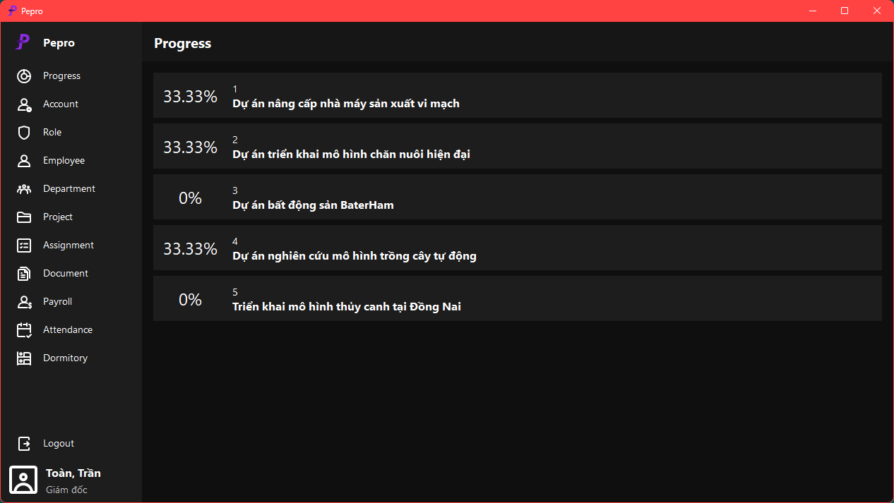
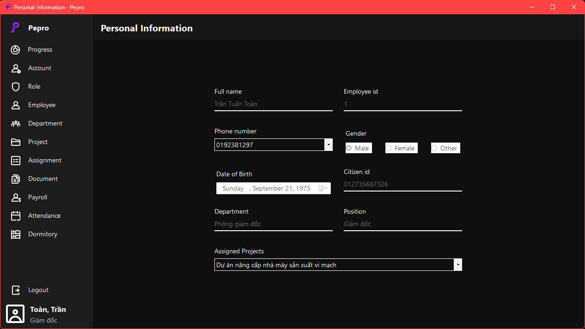
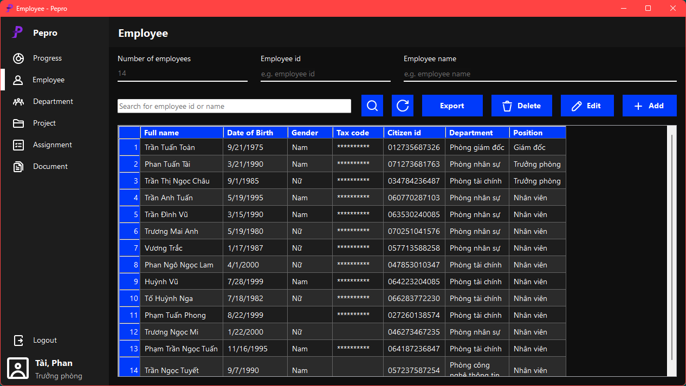
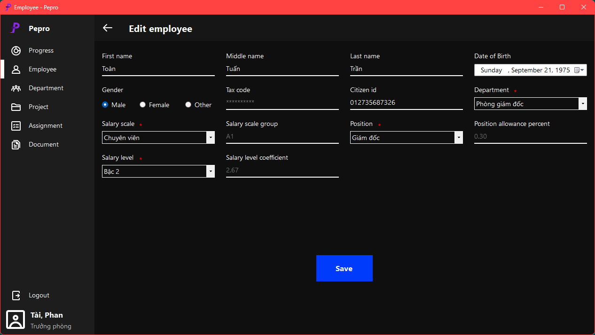
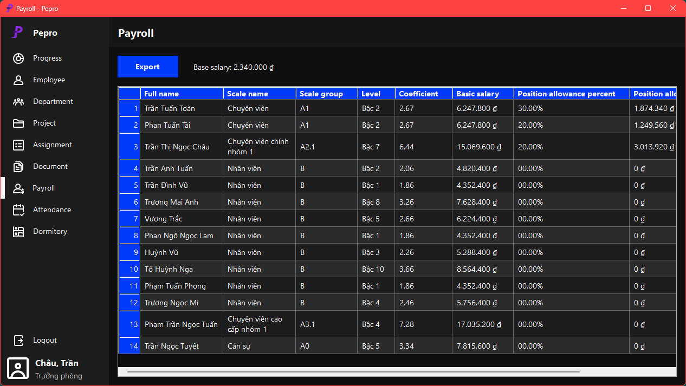
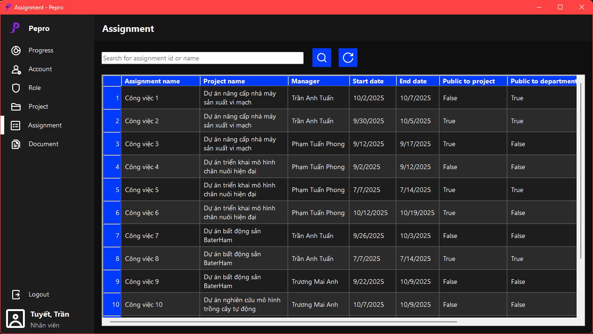

# Pepro


*Make WinForms Great Again!* 🎉

**Pepro** - Personnel and Project Management System (short for *Pepro Management System*) is a Windows Forms (WinForms) application built with C# for managing personnel, projects, payroll, and internal documentation. It is designed for desktop environments with a focus on modular design, 3-layer model architecture, and SQL Server integration.

## 📌 Features

- 👨‍💻 Personnel, Project, task and department management
- 💰 Salary and payroll processing
- 🔐 Secure data with symmetric encryption
- 📊 Role-based access and permission control
- 🧱 Layered architecture, 3-layer model (Presentation, Business, DataAccess)

## 🖥️ Technologies Used

- 💻 **.NET 9+**
- 🧱 **WinForms (Windows Forms)**
- 🗄️ **SQL Server**

## 🛠️ Project Structure

```
Pepro/
├── Pepro.Presentation/		# WinForms UI Layer
├── Pepro.Business/         # Business Logic Layer
├── Pepro.DataAccess/       # SQL Data Access Layer
└── Database/               # SQL scripts (schema + seed)
```

## 🚀 Getting Started

1. Clone the Repository
2. Open in Visual Studio

	* Open [`Pepro.sln`](Pepro.sln) with Visual Studio 2022 or newer

3. Set up the Database

	* Update the connection string in [`Pepro.DataAccess\Utilities\DataProvider.cs`](Pepro.DataAccess\Utilities\DataProvider.cs#L8)

4. Build and Run

	* Set `Pepro.Presentation` as the startup project
	* Press `F5` to run the application

## 🧑‍💻 Contributing

We welcome contributions!

* Check out our [Contributing Guide](CONTRIBUTING.md)
* Follow our [Code Style Guidelines](CODE_STYLE.md)

## 📷 Screenshots


*Figure 1: Login Form*


*Figure 2: Account with Admin role in Main page*

<details>
  <summary>More</summary>


*Figure 3: Personal information page*


*Figure 4: Accounts with roles of Department Head and HR in Employee page*


*Figure 5: Employee information editing page*


*Figure 6: Account with roles of Department Head and Finance in Payroll page*


*Figure 7: Account with IT role in Assignment page*

</details>

## 📃 License

<!-- This project is open source and available under the MIT License. -->
*Not available*
